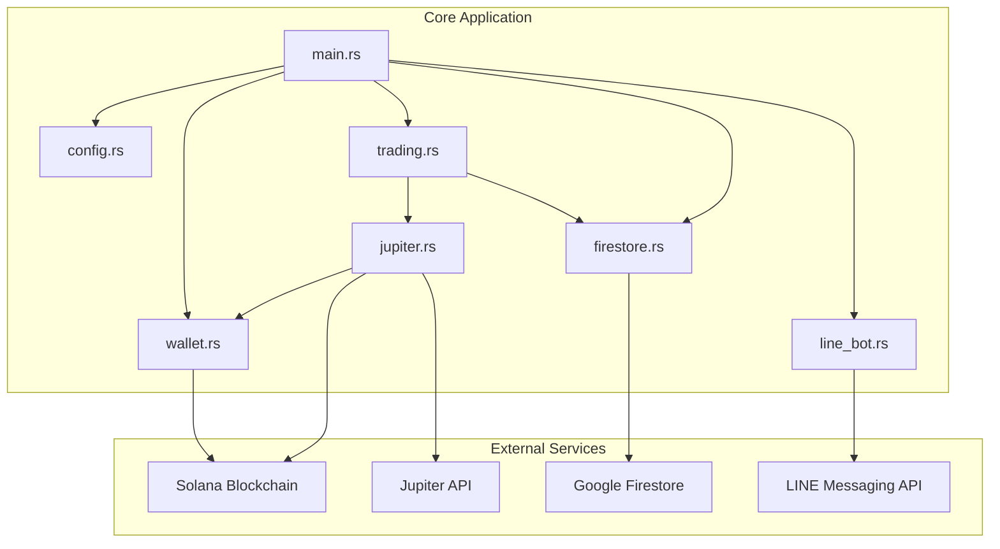
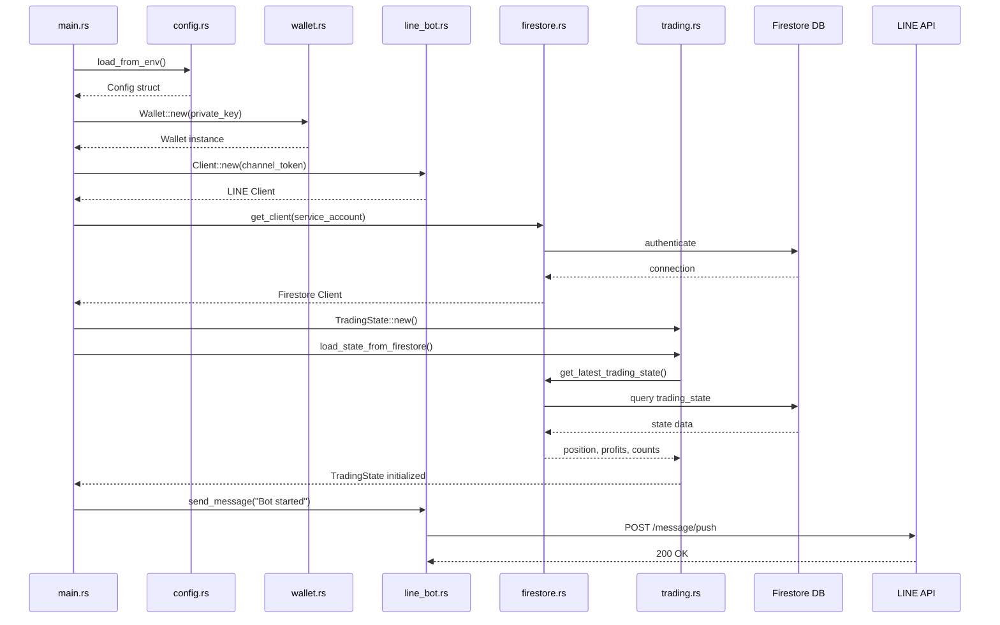
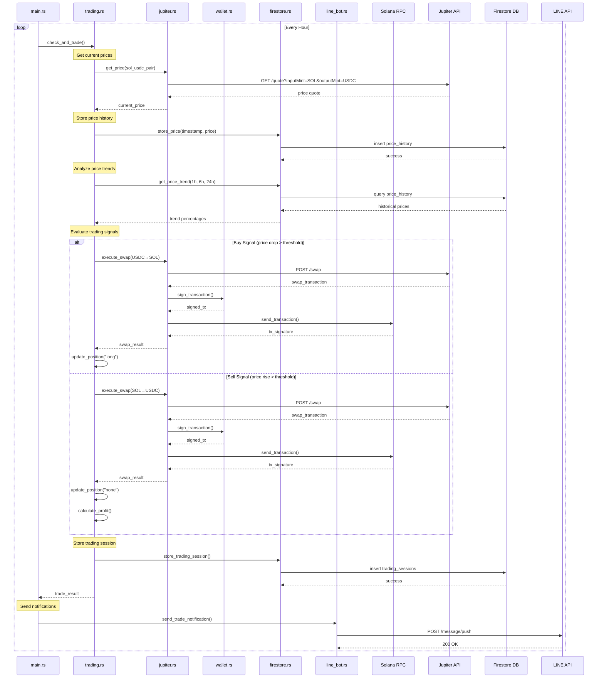
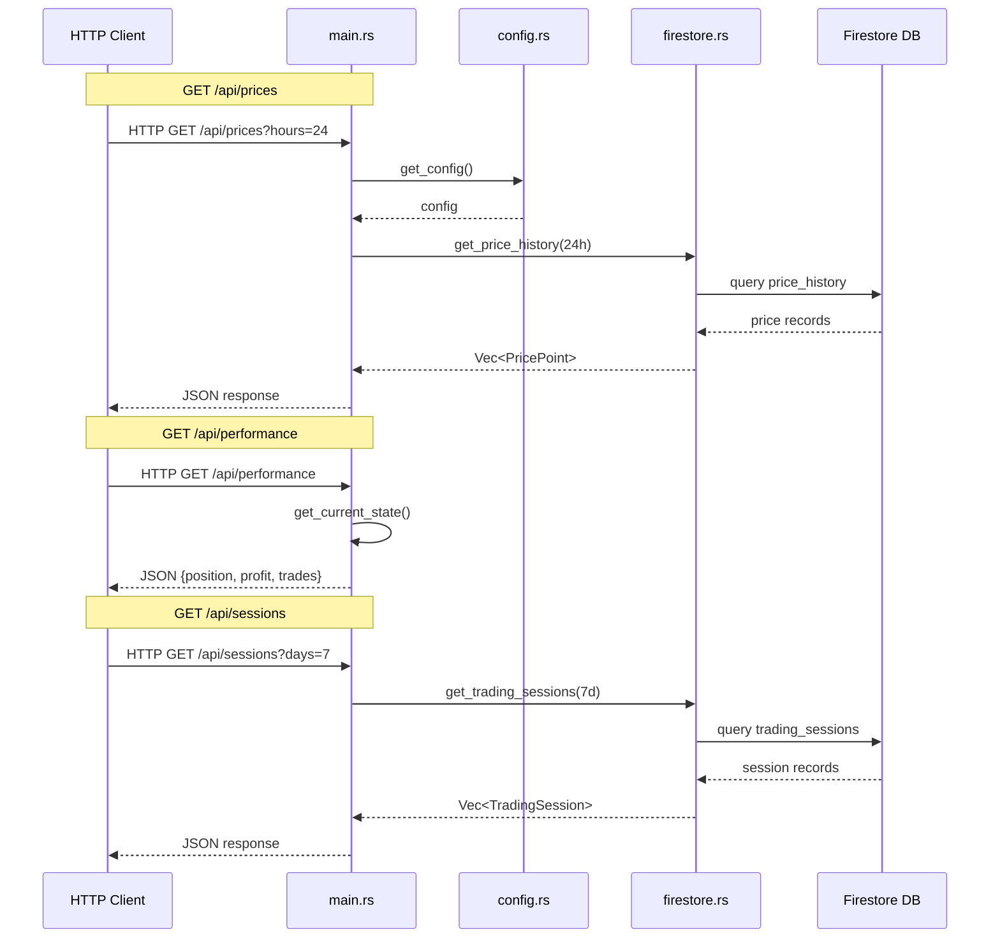
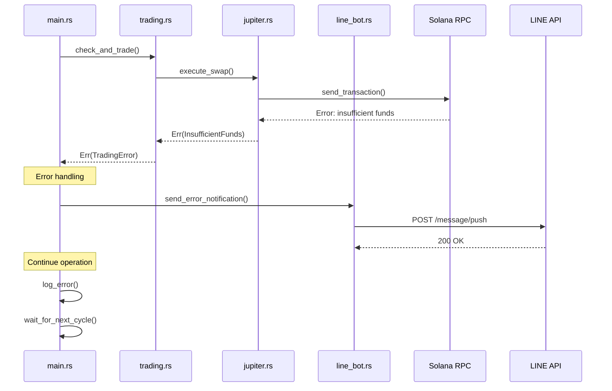

# Solana Trading Bot - Sequence Diagram Documentation

## Overview

This document describes the sequence of interactions between the various modules and external services in the Solana trading bot application.

## System Architecture

## Sequence Diagrams

### 1. Application Startup Sequence

### 2. Trading Loop Sequence (Hourly Execution)

### 3. API Request Handling Sequence

### 4. Error Handling and Recovery Sequence

## Module Responsibilities

### config.rs
- Loads environment variables
- Provides centralized configuration
- Validates required settings

### wallet.rs
- Manages Solana keypair
- Signs transactions
- Queries blockchain balances

### trading.rs
- Implements trading strategy
- Maintains position state
- Calculates profits/losses
- Triggers buy/sell decisions

### jupiter.rs
- Interfaces with Jupiter DEX aggregator
- Gets optimal swap routes
- Executes token swaps
- Handles transaction building

### firestore.rs
- Manages database connections
- Stores price history
- Records trading sessions
- Provides data queries
- Implements retry logic

### line_bot.rs
- Sends trade notifications
- Reports errors
- Notifies system status

### main.rs
- Orchestrates all modules
- Runs hourly trading loop
- Provides HTTP API
- Handles graceful shutdown

## External Service Dependencies

1. **Solana Blockchain (RPC)**
   - Used for: Transaction submission, balance queries
   - Accessed by: wallet.rs, jupiter.rs

2. **Jupiter API**
   - Used for: DEX aggregation, swap routing
   - Endpoint: https://quote-api.jup.ag
   - Accessed by: jupiter.rs

3. **Google Firestore**
   - Used for: Persistent storage
   - Collections: price_history, trading_sessions, trading_state
   - Accessed by: firestore.rs

4. **LINE Messaging API**
   - Used for: Push notifications
   - Endpoint: https://api.line.me
   - Accessed by: line_bot.rs

## Data Flow Summary

1. **Configuration Flow**: Environment → config.rs → all modules
2. **Price Data Flow**: Jupiter API → jupiter.rs → trading.rs → firestore.rs → Firestore DB
3. **Trade Execution Flow**: trading.rs → jupiter.rs → wallet.rs → Solana blockchain
4. **Notification Flow**: trading.rs → main.rs → line_bot.rs → LINE API
5. **API Query Flow**: HTTP client → main.rs → firestore.rs → Firestore DB → HTTP response

## Key Design Decisions

1. **Modular Architecture**: Each module has a single responsibility
2. **Async Operations**: All I/O operations use async/await for performance
3. **Error Propagation**: Errors bubble up to main.rs for centralized handling
4. **State Persistence**: Trading state survives restarts via Firestore
5. **External Service Abstraction**: External APIs are wrapped in dedicated modules